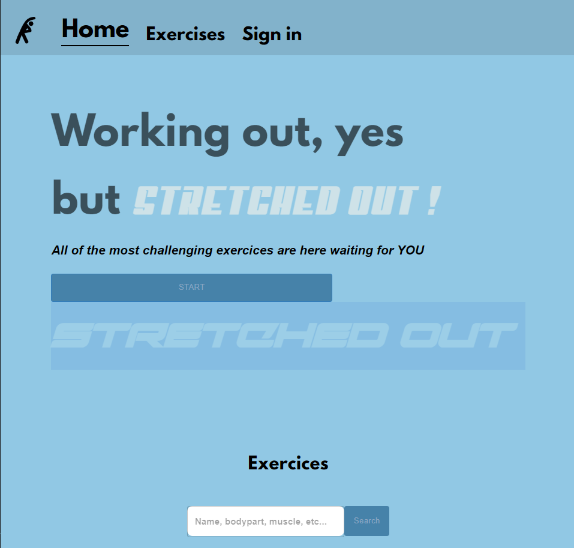

# STRETCHED OUT
Stretched Out est une application web faisant office de compagnon sportif,
je la développe à titre éducatif dans mon temps libre (pour l'instant).




## Stack technique
> Notez que cette section peut évoluer en fonction des besoins de l'app.

Client : HTML CSS JavaScript (ReactJS, Vite)
Server : NodeJS, MongoDB
APIs : "ExerciceDB" de [Justin Mozley](https://rapidapi.com/user/justin-WFnsXH_t6) et "Youtube Search and Download" de [h0p3rwe](https://rapidapi.com/user/h0p3rwe). (Toutes disponibles sur [Rapid API](https://rapidapi.com))

## Fonctionalités
:white_check_mark: = opérationel :construction: = en cours :hourglass_flowing_sand: = prévu
- Voir tout les exercices de l'API :white_check_mark:
- Trier en fonction du matériel à disposition :white_check_mark:
- Trier en fonction de la partie du corps à entrainer :white_check_mark:
- Chercher un exercice en particulier :white_check_mark:
- Représentation graphique des exercices :white_check_mark:
- Identification / authentification :construction:
- Composition d'un programme (sauvegardé sur le compte de l'utilisateur) :hourglass_flowing_sand:
- Redirection vers des vidéos pertinentes pour chaque exercice :white_check_mark:
- Suivi de l'IMC :hourglass_flowing_sand:
- Version mobile :hourglass_flowing_sand:

## Lancement
> [!NOTE]
> L'application étant en early stage, je ne l'ai pas encore déployé proprement. C'est prévu.
Pour lancer l'appli, il vous faut écrire `npm run dev` dans le dossier de cette dernière.
```
cd client
npm i
npm run dev
```
Une fois les commandes exécutées, l'application s'ouvrira par défaut à l'adresse [http://localhost:5173].

## État du projet
Le projet est mis à jour tout les week-ends, la checklist de fonctionalités peut évoluer en fonction de mes envies.
